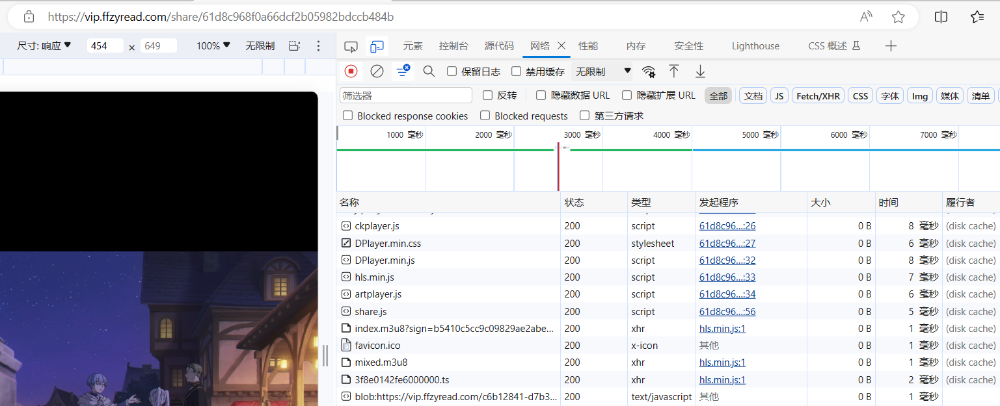
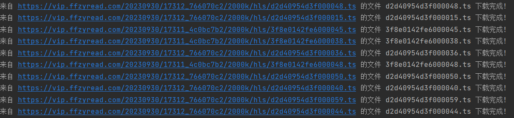
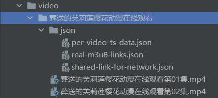

# README

### Before The Beginning
~~Here is my first crawler for the cartoon that I like a lot.~~

In order to improve my coding level, I decide to write a crawler to expand my domain.

At first, I wanted to download a large number of images by hand, but the crazy amount made me give up.

Thus, I would like to write a little crawler for these repeated works.

Firstly, due to the structure of website and the version of python and Windows, the crawler would not fit to other websites or environments.

Secondly, when the website-host update their equipment, the codes won't work as the past. Solving new problems is not my business, I just complete my desire as result.

Finally, keeping learning forever and pursue the truth during your whole life. 
Remember that although some entertainments can satisfy you, you can not forget the real life.

Okay, let's go!

----------------------

### Pre-Do List
1.Install `anaconda3` and create a virtual environment with `python 3.8.0` called `py38`.
```shell
conda create -n py38 python=3.8.0
```
Activate your environment.
```shell
conda activate py38
```
2.Install some packets for need
```shell
pip install -r requirements.txt
```
Only refer the used packets. 
First install tool `pipreqs`
```shell
pip install pipreq
```
You should close the VPN then do the followings.
```shell
pipreqs ./ --encoding=utf8
```
3.Acquire the details of target

Use `Ctrl + Shift + I` or `F12` to check the details of website (Google Browser/ MS edge/ Foxfire).

Pay attention to the following:

If you find the `blob` before the image link, and try to use `XHR` filter.

You are lucky to find that you can find true image links in the details so you can continue to use this structure as your base.

But you are not lucky, you should change the target. But for video, you can find the source m3u8 files.

4.Set the clear folders for your result

You should design a fitted folder structure for your subsequent testing and formal work result in order to avoid the accidents.

My environment:

- `OS`: `Windows 11`

- `PL`: `Python 3.8.0`

- `IDE`: `Pycharm 2021.3.1`

- `PMT`: `Anaconda 2020.3`

My project structure:
```
CartoonCrawler
--prework
  --CartoonCrawler.py
  --CartoonCrawlerThread.py
  --target_web_list.txt
  --VideoDownloader.py
  --m3u8_links.txt
--results
  --ComicName
    --img
      --chapter1
        --1.jpg
        --2.jpg
      --chapter2
        --1.jpg
        --2.jpg
    --pdf
      --chapter1
      --chapter2
    --json
      --crawl-data-set.json
      --real-img-path.json
--video
  --VideoName
    --json
      --shared-link-for-network.json
      --real-m3u8-links.json
      --per-video-ts-data.json
    --temp(It is deleted at the end)
      --0.ts
      --1.ts
      --2.ts
    --chapter1.mp4
    --chapter2.mp4
--examples
  --comics-0.png
  --videos-0.png
```

### Main Work
Process list
1. Get chapter list

2. Get image link list

3. Download images and classify them

4. Convert images to PDF and datalog

5. Accelerate Download

6. Extend to Crawl Videos
#### Crawler For Cartoons
#### Get response
Make fake headers and get target response(200) successfully.

Then, use `bs4` to filter the `response.text` and get the key contents that we need.
Like the title, chapter name, chapter link, image link and others.

`get_contents_conponent` can be used many times and other function are used to identify special properities.

##### Downloader
We need to download those images from their links and place them in the right folders for following converting.
`download_img` as a main operator and `downloader` as a component, they can work together.

##### `Datalog`
We get two important dictionaries: `all_data` and `image_real_path`. I think they will be useful for me in the future, so I decide to write a logging function to record them during crawling.

##### Convert images to PDF
I suppose that it's inconvenient to read comics by flipping through one image after another, so I prefer to make them into a pdf file to read and save.
Without knowing the knowledge, I ask `chatgpt-3.5` for help and write the convert function `create_pdf`.

##### `ThreadPool`
Add `ThreadPool` structure to accelerate the download process, and the download orders are unordered.
More details in the `CartoonCrawlerThread.py` `download_img_threaded`.

### Expanding Work
When we get a cartoon crawler, we should think about more resources in our lives.
Video is also a significant part in our entertainment list.

And if we can crawl the short videos, it means that we can crawl some movies completely!
No matter at all, I start to write a new one crawler for my video requirement after finishing my cartoon crawler.

#### Crawler For Videos
##### Crawler Baseline
Ok, the similar structure is as the cartoon crawler.
Guys, because I feel lazy to rewrite a new structure.

##### Analysis Before The Beginning

I find the key problem is to resolve the real link of the blob video. Because the employers always used a js function to encode and cut the whole video into different files *ts. If we wanted to get the whole video, we had to get all real links of the cut *ts file and download them to connect them to a complete one. But we don't know whether the encryption technology exists in them or not.

So the first thing we need to do is to write a program to resolve the real link from the blob type link. Usually, it will show the real link through the m3u8 filter in our browser development tool. But we should make it autonomous to get these links for us.

The second thing is that we can download a helpful tool `ffmpeg` to assist our download *ts files. It also can connect them to a video. But you can directly connect them without this tool.

The third thing is to accelerate the downloading process, because we will download hundreds of videos from links.

Theory established, practice begins.

##### Get real links from blob links
The first step in my plan is also a vital and difficult problem in front of me. How to get the real link without the m3u8 filter in the browser development tool?

I just wrote a little demo to try some tricky methods, but I failed. We had to get these links by hand.

##### Use `ffmpeg` or `requests` for downloading and connection
So we spend more time and energy on this part. I learnt something excellent on the `Bilibili`. 
Most of ideas from there and I added my structures into it.

[Reference Link](https://www.bilibili.com/video/BV11G411p7SY/?share_source=copy_web&vd_source=8faba230489e73df07b01f9c8659149a)

##### Accelerate the downloading process

Faster, the better. We need `ThreadPool` to speed up. So we can learn something similar from cartoon crawler and finally we can get a `blob-video` downloader program demo.

The most important codes are as follows.

```python
# Use thread pool to make sub-works work together
# original order: 1->2->3->4->...->end
# current order: 2.0->1.0->3.0->2.1->1.1->4.0->3.1->4.1->...->end
def download_video(self, m3u8_links):
    with concurrent.futures.ThreadPoolExecutor() as executor:
        futures = [executor.submit(self.download_single_video, link.copy()) for link in m3u8_links]
        concurrent.futures.wait(futures)
        for _ in futures:
            try:
                pass
            except Exception as e:
                print(f"Error in download: {e}")
                
# Sub work
def download_single_video(self, link):
    if len(link.items()) > 3:
        m3u8_link = link['m3u8_link']
        mp4_name = self.video_name + link['chapter_name'] + '.mp4'
        download_links, path_names = self.preHandle_m3u8_link(web=m3u8_link)
        temp_folder_path = self.downloader(download_links=download_links, path_names=path_names)
        temp_obj = {'mp4_name': mp4_name, 'temp_folder_path': temp_folder_path, 'path_names': path_names}
        self.ts_data.append(temp_obj)
        
# Fill complete m3u8 links and get names for ts files
def preHandle_m3u8_link(self, web):
    # get all m3u8 complete links
    pattern = re.compile(r'\b\w+\.ts\b')
    last_slash_index = web.rfind('/')
    prefix = web[:last_slash_index + 1]
    response = self.session.get(web, headers=self.headers)
    if response.status_code == 200:
        init_contents = response.text
        # filter *.ts string and add prefix to it
        path_names = pattern.findall(init_contents)
        ts_list = [(prefix + ts) for ts in path_names]
        return ts_list, path_names
    
# Use thread pool to download unordered videos 
# original order: 1.ts->2.ts->3.ts->...->end.ts
# current order: 4.ts->1.ts->2.ts->3.ts->...->end.ts
def downloader(self, download_links, path_names):
    temp_folder_path = os.path.join(self.absolute_path, 'temp')
    os.makedirs(temp_folder_path, exist_ok=True)
    with concurrent.futures.ThreadPoolExecutor() as executor:
        # as_completed
        futures = [executor.submit(self.download_ts, link, name, temp_folder_path) for link, name in
                   zip(download_links, path_names)]
        for _ in concurrent.futures.as_completed(futures):
            try:
                pass
            except Exception as e:
                print(f"Error in downloading ts file: {e}")
    return temp_folder_path

# Main ts-downloader
def download_ts(self, link, name, temp_folder_path):
    ts_path = os.path.join(temp_folder_path, name)
    try:
        response = self.session.get(link, headers=self.headers)
        response.raise_for_status()
        with open(ts_path, 'wb') as file:
            file.write(response.content)
        print(f'来自 {link} 的文件 {name} 下载完成!')
    except requests.exceptions.RequestException as e:
        print(f"Error in downloading ts file {name}: {e}")
```
Pay attention to the connection order. Connecting *.ts files during the downloading process will cause bugs when you don't download all *.ts files.
So you had to download all *.ts files and then connect them to avoid this situation.

What's more, remember to manage the proper order in your program when you're using `ThreadPool`.
Something wrong will occur in your wrong-order program. 

### Afterwords
I encountered and resolved several bugs while developing this VideoCrawler. Most of these issues were related to the order of execution in the `ThreadPool` and the connection of non-existent files.

Unfortunately, I couldn't find a solution in python to the problem of extracting the m3u8 link from a blob link. This might require advanced techniques such as a browser plugin, flow analysis, or other methods.

One potential solution could involve developing a browser plugin to capture the flow within the browser, eliminating the need to manually check the network flow details using `F12 / Ctrl + Shift + I`. However, this task is beyond the scope of my work, as there are already numerous codes available on the Internet.

I have deviated from my original source but have successfully reached my destination.
### Testing Examples
#### Comics
All testing links are from [target website](https://www.cmh5.com).
1. Write down your target links into the `target_web_list.txt`.


2. Run the `CartoonCrawlerThread.py`.
```shell
cd ./CartoonCrawler
cd ./prework
python CartoonCrawlerThread.py
```


3. Check the `results` folder.


Check the json files.


Check the pdf files.


#### Videos

All testing links are from [target website](https://www.yhdmdm.com).
1. Run the `VideoDownloader.py`.
```shell
cd ./CartoonCrawler
cd ./prework
python VideoDownloader.py
```


2. Check the `shared-link-for-network.json` in `json` folder.


3. Write down real m3u8 links into `m3u8_links.txt`.




4. Run the `VideoDownloader.py` again.



5. Check the `video` folder.

Check the json files.


Check the video files.




### Add UI
Turn to [Latest.md](ui/Latest.md)