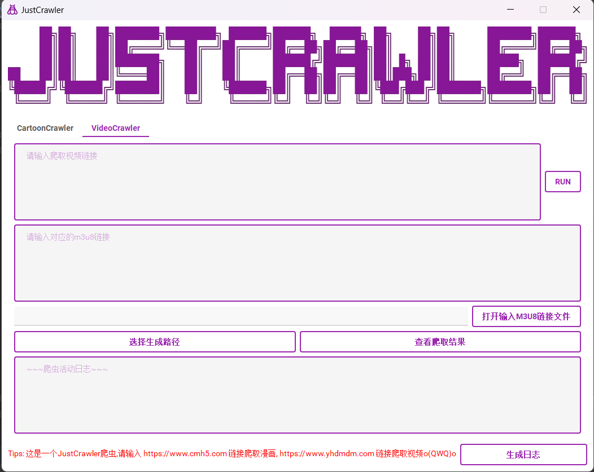

# README AGAIN
I think it should have a suitable UI for using. Or you can make it a beautiful command tool through adding some banner.

When having the core codes, I can write it easily.
Most of them are related to `qt5`.

You had better install the `qt-creator` into your `pycharm` before our work begin.

Version: `Qt 5.15.9`

The code structure is kept simple because I don't want to complicate things.
### Codes for UI
#### init page
Import all dependencies related to `UI`.
```python
from PyQt5.QtCore import Qt
from PyQt5.QtWidgets import QApplication, QMainWindow, QPushButton, QVBoxLayout, \
    QWidget, QHBoxLayout, QTextEdit, QTextBrowser, QLineEdit, QLabel, QTabWidget, QFrame
from PyQt5.QtGui import QIcon, QPixmap
from qt_material import apply_stylesheet
```
Create main `QMainWindow` class.
```python
class JustCrawlerWindow(QMainWindow):
    def __init__(self):
        super().__init__()
        self.setWindowTitle("JustCrawler")
        self.setWindowIcon(QIcon('img/icon.png'))
        self.setFixedSize(1048, 800)
        # mainframe
        main_frame = QFrame()
        main_layout = QVBoxLayout(main_frame)
        # create TabWidget
        tabWidget = QTabWidget()
        # set banner
        pixmap = QPixmap('img/start.png')
        banner = QLabel()
        banner.setPixmap(pixmap)
        banner.setScaledContents(True)
        # set tips
        tips_label = QLabel("Tips: 这是一个JustCrawler爬虫,请输入 https://www.cmh5.com 链接爬取漫画, https://www.yhdmdm.com 链接爬取视频o("
                            "QWQ)o")
        tips_label.setStyleSheet("color: red")
        tips_label.setTextInteractionFlags(Qt.TextSelectableByMouse)  # copy enable
        # log button
        h_layout = QHBoxLayout()
        self.log_button = QPushButton('生成日志')
        h_layout.addWidget(tips_label)
        h_layout.addWidget(self.log_button)
        # For CartoonCrawler Page
        # first create the container
        container = QWidget()
        layout = QVBoxLayout(container)
        # we need three QHBoxLayout components
        self.h_layout_1 = QHBoxLayout()
        self.h_layout_2 = QHBoxLayout()
        self.h_layout_3 = QHBoxLayout()
        # init everything
        self.comics_run = QPushButton(text='RUN')
        self.open_file_button = QPushButton(text='打开输入文件')
        self.select_save_path = QPushButton(text='选择生成路径')
        self.check_crawler_result = QPushButton(text='查看爬取结果')

        self.textBrowser = QTextBrowser()
        self.textEditor_input = QTextEdit()
        self.lineEditor_show = QLineEdit()
        self.lineEditor_show.setReadOnly(True)
        self.textEditor_input.setPlaceholderText('请输入爬取漫画链接')
        self.textBrowser.setPlaceholderText('~~~爬虫活动日志~~~')
        # for 1: textEditor + button
        self.h_layout_1.addWidget(self.textEditor_input)
        self.h_layout_1.addWidget(self.comics_run)
        # for 2: lineEditor + button
        self.h_layout_2.addWidget(self.lineEditor_show)
        self.h_layout_2.addWidget(self.open_file_button)
        # for 3: two buttons
        self.h_layout_3.addWidget(self.select_save_path)
        self.h_layout_3.addWidget(self.check_crawler_result)

        layout.addLayout(self.h_layout_1)
        layout.addLayout(self.h_layout_2)
        layout.addLayout(self.h_layout_3)
        layout.addWidget(self.textBrowser)
        # layout.addWidget(tips_label)
        # For VideoCrawler
        container_ = QWidget()
        layout_ = QVBoxLayout(container_)
        self.textBrowser_ = QTextBrowser()
        self.textEditor_input_web = QTextEdit()
        self.textEditor_input_m3u8 = QTextEdit()
        self.lineEditor_show_ = QLineEdit()
        self.lineEditor_show_.setReadOnly(True)
        self.textEditor_input_web.setPlaceholderText('请输入爬取视频链接')
        self.textEditor_input_m3u8.setPlaceholderText('请输入对应的m3u8链接')
        self.textBrowser_.setPlaceholderText('~~~爬虫活动日志~~~')
        # string input / file input
        self.h_layout_4 = QHBoxLayout()
        self.h_layout_5 = QHBoxLayout()
        self.h_layout_6 = QHBoxLayout()

        self.video_run = QPushButton(text='RUN')
        self.open_m3u8_file = QPushButton(text='打开输入m3u8链接文件')
        self.select_save_path_ = QPushButton(text='选择生成路径')
        self.check_crawler_result_ = QPushButton(text='查看爬取结果')

        # for 4: textEditor + button
        self.h_layout_4.addWidget(self.textEditor_input_web)
        self.h_layout_4.addWidget(self.video_run)
        # for 5: lineEditor + button
        self.h_layout_5.addWidget(self.lineEditor_show_)
        self.h_layout_5.addWidget(self.open_m3u8_file)
        # for 6: 2 buttons
        self.h_layout_6.addWidget(self.select_save_path_)
        self.h_layout_6.addWidget(self.check_crawler_result_)

        layout_.addLayout(self.h_layout_4)
        layout_.addWidget(self.textEditor_input_m3u8)
        layout_.addLayout(self.h_layout_5)
        layout_.addLayout(self.h_layout_6)
        layout_.addWidget(self.textBrowser_)

        tabWidget.addTab(container, "CartoonCrawler")
        tabWidget.addTab(container_, "VideoCrawler")
        # set main layout
        main_layout.addWidget(banner)
        main_layout.addWidget(tabWidget)
        main_layout.addLayout(h_layout)

        self.setCentralWidget(main_frame)
```
It is different between the`addWidget` and `addLayout`. Don't mix them.

Show `JustCrawlerWindow` object.
```python
if __name__ == '__main__':
    app = QApplication([])
    just_crawler = JustCrawlerWindow()
    apply_stylesheet(app, theme='light_purple_500.xml', invert_secondary=True)
    just_crawler.show()
    app.exec_()
```
#### main controlling function

#### fix the function of input and output

### Example
#### comics

##### test

#### video


##### test

### Git tips
#### turn to your project folder
```shell
cd ./CartoonCrawler
```
### init
```shell
git init .
```

### add 
#### anything in current folder
```shell
git add .
```
#### unique folder
```shell
git add prework/
```
#### unique file type
```shell
git add *.py
```
#### more files with different types
```shell
git add prework/CartoonCrawler.py target_web_list.txt README.md
```

### remove
#### unique folder/file in force
```shell
git rm -r test/?.py -f
```
#### remove add operator for something 
```shell
git reset HEAD test/?.py
```
#### remove update operator for something
```shell
git checkout -- test/?.py
```

### commit
#### check current status
```shell
git status
```
#### check commit log
```shell
git log
```
#### commit your work after add operator
```shell
git commit -m "my first/second/... commit"
```

### branch
#### create new branch
```shell
git branch dxz
```
#### check current branch
```shell
git branch
```
#### switch to new branch
```shell
git checkout dxz
```
#### create a new branch "new_branch" and switch to it
```shell
git checkout -b new_branch
```
#### remove local branch 
```shell
git branch -d main/master
```
#### remove remote branch
```shell
git push your_set_name --delete remote_branch
```

### Remote part
#### connect remote repository
```shell
git remote add your_set_name <git_link>
```
#### check connection
```shell
git remote -v
```
#### push your commit
```shell
git push -u your_set_name your_branch
```
if your_set_name is the same as your_branch, just use:
```shell
git push -u your_branch
```
if your repository has many branches, remember to change the push target branch.

For example:
```shell
git push -u acg main
```
```shell
git push -u acg test
```